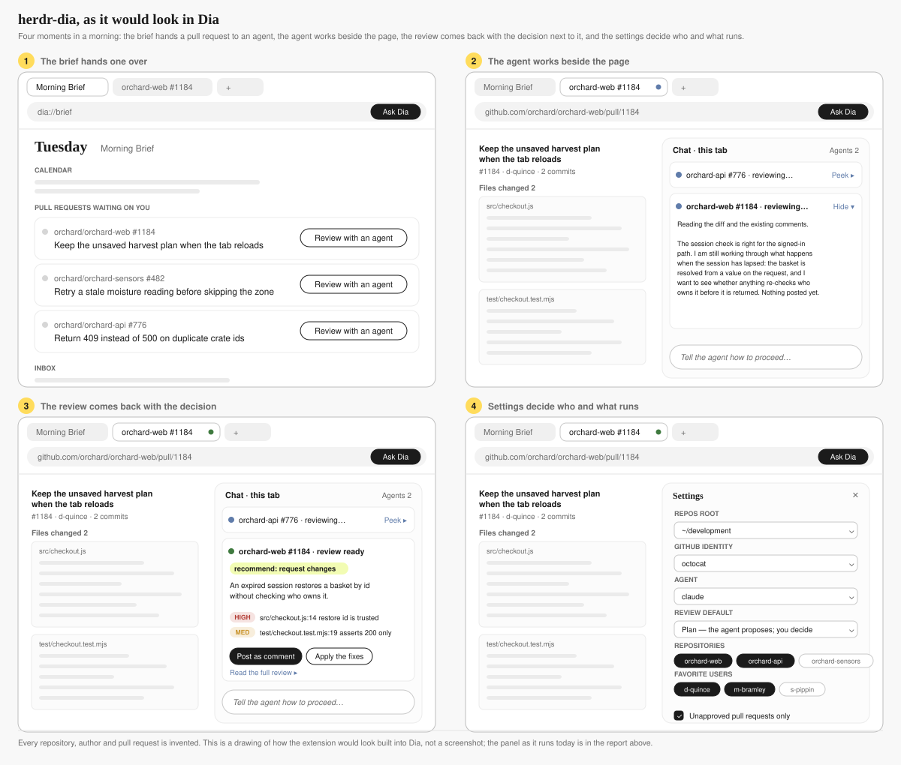

# herdr-dia: design document and prototype handoff

Design document for the herdr-dia prototype: the implementation as built, the decisions behind it, a proposed integration into the browser, and the evaluation plan.

| | |
| --- | --- |
| Status | In review |
| Author | Kevin Gibson |
| Reviewers | Model Behavior team, Dia (requested) |
| Created | 2026-09-02 |
| Last updated | 2026-09-03 |
| Repository | [github.com/rewt/herdr-dia](https://github.com/rewt/herdr-dia), v0.1.1, MIT |
| Related | [AGENTS.md](AGENTS.md), [TESTING.md](TESTING.md), [docs/adr](docs/adr/README.md) |

## 1. Summary

herdr-dia is a browser side panel and a local native messaging host. From a GitHub pull request open in Dia, or from a queue of pull requests awaiting the user, it dispatches a review or an update to a coding agent running on the user's machine, monitors the agent, exposes the review before and after completion, and routes the user's decision back to the agent. The prototype is complete, in daily use by its author, and covered by 223 offline tests. This document records the design as built (section 4), indexes the decision records (section 5), describes an integration into the browser and the assumptions it depends on (section 6), and specifies the evaluation plan for review quality (section 10). Open items are listed in sections 13 and 14.

## 2. Motivation

Dia's Morning Brief lists the pull requests awaiting the user's review. Dia can read and discuss a pull request but cannot act on it. Acting requires a terminal, a checkout and a coding agent, and the context established in the browser does not travel to them. The prototype tests the hypothesis that dispatching review and update work from the browser, with the agent kept visible, turns the brief from a reading list into a work queue.

### 2.1 Goals

- Dispatch a review or an update of a pull request from the browser to a locally running coding agent, in the user's own checkout and under the user's own identity.
- Keep the agent's state visible in the browser, including partial output while it runs.
- Present a finished review with structured findings and route the user's decision back to the agent.
- Support any agent the local runtime provides, without code per agent in the extension.
- Make no irreversible change to a pull request without a user action.

### 2.2 Non-goals

- Reading or writing Dia's chat. Not reachable from an extension.
- Hosted execution. The agent runs on the user's machine.
- Surfaces other than pull requests.
- Distribution. The extension is loaded unpacked.

## 3. Background

### 3.1 Environment

| Component | Role in the prototype |
| --- | --- |
| Dia | Browser built on Chromium. Loads unpacked extensions; provides the side panel and native messaging APIs used here. |
| Herdr | Local terminal workspace manager. Unix socket, protocol 20, JSON, one object per line, one request per connection, `events.subscribe` as the only stream. Provides agent start, screen read, status, key input, and tab and workspace lifecycle. |
| Coding agents | Whatever Herdr's manifests list (Claude Code, Codex, Gemini and others). Claude Code exposes a read-only plan mode (`--permission-mode plan`); the others expose no equivalent. |
| GitHub | Accessed through the user's `gh` CLI and its configured identities. |

### 3.2 Facts and assumptions about Dia

Dia's internals are not public. Table 1 separates verified facts (F) from assumptions (A). Sections 6, 7 and 13 depend on the assumptions; each carries a verification step.

Table 1. Facts and assumptions.

| ID | Statement | Type | Basis or verification |
| --- | --- | --- | --- |
| F1 | Dia loads unpacked extensions and supports the side panel and native messaging APIs. | Fact | The prototype runs in Dia. |
| F2 | Morning Brief, Live Work, Profiles and the tab's chat are features a user sees. | Fact | Product site; daily use. |
| F3 | Dia's chat runs on an agent harness. | Stated | Role description. Shape unknown. |
| A1 | A feature of the browser can do what the extension does: open a panel, reach a local process, read the current tab, hold state beyond a panel's lifetime. | Assumption | Chromium capabilities. Confirm with the Dia team. |
| A2 | A feature of the browser would be permitted to start a process on the user's machine. | Assumption, low confidence | Product and security decision. |
| A3 | The chat can render a turn that does not originate from its own model, and a feature can read the conversation. | Assumption | Confirm against the harness. |
| A4 | Hosted execution (a sandbox per pull request) is available or acceptable. | Assumption, low confidence | Infrastructure decision. |
| A5 | A GitHub connection exists through which an agent could act. | Assumption | Live Work implies a connection; scope unknown. |

## 4. Design

### 4.1 System context

```
Dia side panel ── native messaging ── host/bridge.mjs ── herdr.sock ── Herdr ── agent ── gh / git ── GitHub
extension/panel.js  4-byte LE + JSON    pipe + dia.* routes           tabs · agents · events
```

Table 2. Components.

| Component | Location | Responsibility |
| --- | --- | --- |
| Side panel | `extension/panel.js`, `panel.html`, `panel.css` | View and controls: the current tab's pull request, the Active board, the review queue, settings. Polls agents every 5 s, sessions every 8 s, the queue every 20 s. |
| Panel logic | `extension/logic.js` | Decisions with no DOM: ready state, status words, merge rule, queue fingerprint. |
| Host | `host/bridge.mjs` | Native messaging host. Transparent pipe to the Herdr socket plus fourteen `dia.*` routes. |
| Host library | `host/lib.mjs` | Briefs, `HERDR_DIA_RESULT` parser, agent naming, repository resolution, worktree creation. |
| State | `~/.herdr-dia/` | `sessions.json`, `worktrees.json`, `reviews/<owner>/<repo>/<n>.json`, `queue-cache/`. Never inside a checkout. |
| Installer | `scripts/install.mjs` | Registers the host manifest for each Chromium browser found and pins the extension id in `allowed_origins`. |

### 4.2 Interfaces

Messages in both directions are `{ id, method, params }` and `{ id, result | error }`, Herdr's own shape. Routes that take time emit `{ id, progress }` before the result. Subscription events arrive as `{ subscription, event, data }`. A frame is limited to 1 MB by native messaging. Any method not listed below is forwarded to Herdr unchanged.

Table 3. Host routes.

| Route | Function |
| --- | --- |
| `dia.hello` | Handshake: socket path, pid, home, default repos root. |
| `dia.subscribe` | Opens the Herdr event stream and relays events to the panel. |
| `dia.config` | Machine inventory: `gh` config directories with their accounts, agents Herdr knows, Claude Code config directories. |
| `dia.queue` | The review queue (section 4.5). |
| `dia.launch` | Pull request plus instruction to workspace tab, agent and brief. The only route that starts work. |
| `dia.sessions` | The Active board: session registry joined with live agents. |
| `dia.review_text` | Reads a review out of an agent (plan file or scrollback). |
| `dia.proceed` | Sends the user's instruction and answers the agent's dialogs on the user's behalf. |
| `dia.merge_pr` | Merges one of the user's own pull requests with a method the repository allows. |
| `dia.resolve_user` | Validates a typed favorite against the GitHub API. |
| `dia.worktrees`, `dia.remove_worktree` | Lists update worktrees; removes one without `--force`, keeping the branch. |
| `dia.end_session`, `dia.dismiss_session` | Closes a session's tab and clean worktree; or forgets the session only. |

Review results are structured. A plan mode review ends with one line of JSON; a review without plan mode writes the same object to `~/.herdr-dia/reviews/<owner>/<repo>/<n>.json` with an added `comment_url`.

```
HERDR_DIA_RESULT {"pr":"<owner>/<repo>#<n>","summary":"<one sentence>",
  "recommendation":"approve|request-changes|comment",
  "findings":[{"severity":"high|medium|low","file":"<path>","line":<n|null>,"title":"<short>","suggestion":"<fix>"}]}
```

### 4.3 Review flow

1. The user selects Review with an agent on the current tab's pull request or on a queue row. The panel calls `dia.launch` with mode `review`, the configured agent kind, plan mode preference, repos root and identities.
2. The host resolves the repository to an existing checkout under the repos root (`<root>/<repo>`, `<root>/<owner>/<repo>`, or one level down, matched on `origin`), or to `<root>/<repo>` for a fresh clone.
3. The host locates or creates the single Herdr workspace labelled `herdr-dia`, creates a tab labelled `<repo>#<n> review` in the checkout with `GH_CONFIG_DIR` and `CLAUDE_CONFIG_DIR` in its environment and direnv state cleared, and closes any empty root tab.
4. The host starts the agent (`agent.start`, retrying `agent_pane_busy` for 20 s). For Claude Code in plan mode the arguments are `--permission-mode plan`. It waits until the agent has reported `idle` for two consecutive polls, one second apart, answering Claude Code's folder trust dialog if shown, then sends the brief (`planReviewBrief` or `reviewBrief` in `host/lib.mjs`).
5. If the review was dispatched from a notification, the host marks the thread read and invalidates the queue cache for that identity. The launch is recorded in `sessions.json`.
6. The panel shows the session as `reviewing…`. Peek calls `dia.review_text`, which returns the pane's scrollback while the agent is running.
7. On completion a plan mode agent stops at its exit plan dialog. Herdr reports `blocked`; the panel reports `review ready` (section 4.6). Read review calls `dia.review_text`, which reads the plan file named on the dialog screen and parses the `HERDR_DIA_RESULT` line.
8. The user types an instruction, or selects Post as comment or Apply the fixes, which are instructions with prepared wording. The panel calls `dia.proceed`. The host dismisses the plan dialog, sends the instruction with an explicit approval to leave plan mode, then for up to six minutes answers the exit plan dialog and recognised tool permission prompts. Unrecognised prompts are reported and left to the user.
9. An agent without plan mode posts its review as a comment beginning "Agent review (herdr-dia)" and writes the findings file. The panel offers Fix these, Review again, and a link to the comment.

### 4.4 Update flow

1. The user enters an instruction and selects Update the PR, or selects Fix these on a reviewed pull request (the instruction is generated from the findings).
2. For an existing checkout the host creates a git worktree at `~/.herdr-dia/worktrees/<repo>/pr-<n>` on branch `herdr-dia/pr-<n>`, sharing the checkout's `.git`, and records it in `worktrees.json`. Without a checkout the tab opens at `<root>/<repo>` and the brief instructs the agent to clone.
3. The agent receives `implementBrief`: check out the pull request branch, apply the instruction, commit in the branch's existing style, push to the pull request branch, summarise.
4. End closes the tab and removes the worktree if clean. A worktree with uncommitted changes is retained and listed under Settings. The branch is always retained.

### 4.5 Review queue

Sources: `gh api notifications`, `gh search prs --review-requested=@me --state=open` (with `--review required` unless disabled), and one GraphQL search for the user's own pull requests (with a REST fallback). Tiers: Favorites, Mine, Brief, Team, Other, as defined in ADR-0005. Each pull request is decorated with any recorded review result and any live agent whose name matches it. GitHub's answers are cached per identity for ten seconds in memory and started warm from a file per identity for up to ten minutes; the panel displays the age and disables Merge while a remembered answer is on screen.

### 4.6 Session status

Table 4. Herdr status to panel status (`extension/logic.js`).

| Herdr status | Mode | Condition | Panel |
| --- | --- | --- | --- |
| `working`, `unknown` | any | | `reviewing…` or `updating…` |
| `idle` | review | held less than 45 s | `reviewing…` |
| `idle` | review | held 45 s or more | `review ready` |
| `blocked` | review | | `review ready` (see K2) |
| `blocked` | update | | `needs you` |
| `done` | review | | `review ready` |
| `done` | update | | `done` |
| absent | any | | `finished` |

### 4.7 Identity and environment

Two settings travel into each session's environment: `GH_CONFIG_DIR` (the `gh` login for the queue and the agent's pushes) and `CLAUDE_CONFIG_DIR` (the Claude Code login). The host clears `DIRENV_DIFF`, `DIRENV_DIR`, `DIRENV_FILE` and `DIRENV_WATCHES` so a pane starting in a directory without `.envrc` does not revert them. `gh` is executed from `os.tmpdir()` unless a working directory is required, so an identity wrapper on `PATH` cannot override the explicit config directory. Queue cache keys and cache files carry the identity, so one login's answers are never served to another.

### 4.8 User interface

<table>
<tr>
<td width="50%" valign="top">

<p>Figure 2. Active board, review ready: findings, recommendation, review text, instruction field, Post as comment and Apply the fixes.</p>
</td>
<td width="50%" valign="top">

<p>Figure 3. Active board, reviewing: Peek showing the agent's partial output.</p>
</td>
</tr>
<tr>
<td width="50%" valign="top">

<p>Figure 4. Review queue, Mine: review decision badges; Merge enabled only when approved and mergeable.</p>
</td>
<td width="50%" valign="top">

<p>Figure 5. Review queue, Favorites: pull requests grouped by marked author.</p>
</td>
</tr>
</table>

Screenshots are the production panel rendered against fictional fixture data (`node scripts/demo.mjs`).

## 5. Design decisions

Each decision is recorded in Nygard format under [docs/adr](docs/adr/README.md).

Table 5. Decision records.

| ID | Decision | Principal consequence |
| --- | --- | --- |
| [ADR-0001](docs/adr/0001-local-runtime.md) | Run the agent on the user's machine through Herdr | Real checkout and identity; assumes an installed runtime; environment inherited |
| [ADR-0002](docs/adr/0002-plan-mode-gate.md) | Gate reviews with the agent's own read-only mode | No permission code; gate is per agent; depends on dialog wording |
| [ADR-0003](docs/adr/0003-read-review-from-agent.md) | Read the review out of the agent's pane and plan file | Read changes nothing; depends on plan path on screen |
| [ADR-0004](docs/adr/0004-ready-state.md) | Define ready as done, plan dialog, or idle held 45 s | Ready lags up to 45 s; K2 |
| [ADR-0005](docs/adr/0005-queue-source.md) | Build the queue from notifications and review requests | Usable across many repositories; duplicates the brief |
| [ADR-0006](docs/adr/0006-worktree-updates.md) | Run updates in a git worktree of the user's checkout | No collisions; branch always retained; requires a checkout |
| [ADR-0007](docs/adr/0007-transparent-host.md) | Make the host a transparent pipe with no allowlist | Small and testable; boundary is the machine; not for hosted use |
| [ADR-0008](docs/adr/0008-session-registry.md) | Keep sessions in a registry reconciled with live agents | Survives restarts; K1 |
| [ADR-0009](docs/adr/0009-tests-without-browser.md) | Test the host and panel without a browser | 223 offline tests; UI operation remains manual |

## 6. Proposed integration with Dia

This section describes how the prototype's functions would map onto Dia as a feature of the browser. Figure 1 covers the user-facing half only, using Dia's surface as a user sees it (F2); what would sit underneath is discussed as prose in 6.1 because it depends on assumptions A1 to A5 that this document cannot settle.



Figure 1. The feature as a user would meet it. Numbered elements:

1. The brief's own pull request list carries the dispatch action. Depends on the brief's list being addressable by a feature (A1).
2. A dispatched item remains in the brief with its live state, so the morning list is also the board.
3. A running agent appears as a collapsed card in the tab's chat with Peek. Live Work already places the pull request in the tab strip (F2); the tab carries the same state.
4. The finished review is delivered as a turn in the chat, in the conversation where the diff was discussed (A3), with the findings and the two shortcuts beside it.
5. The chat input is the reply to the agent. If the conversation is readable by the feature (A3), the update brief carries the agreed change without a paste.
6. Settings select the coding agent, the GitHub identity, the review default of Plan or Auto, and the repository and author filters. Profiles would replace the identity picker (A5).

### 6.1 What would sit underneath

Unknown, and this document does not propose a design for it. The prototype's host converged on five operations (launch, status, read, proceed, end), and any implementation would need something equivalent behind whichever runtime executes the agent: a local process on the user's machine as today (A2), or hosted execution per pull request (A4). Which of those is available decides ADR-0001, ADR-0002 and ADR-0006, and it is question Q1.

Table 6. Component mapping.

| Prototype component | Proposed equivalent | Depends on |
| --- | --- | --- |
| Side panel | Cards and turns in the tab's chat | A3 |
| Queue from notifications and review requests, five tiers | The brief's list, with favorites as a ranking signal | A1 |
| Native messaging host | Dia's mechanism for reaching a local process, or none if execution is hosted | A2 or A4 |
| Herdr socket as a hard dependency | Runtime interface with local and hosted implementations | A2, A4 |
| GitHub identity and Claude login pickers | Profiles and an existing GitHub connection | A5 |
| Paste field for the agreed change | The conversation | A3 |
| Plan mode as the read-only gate | Retained where an agent provides one; held by the credentials otherwise | A4 |
| Merge button, worktree list, Other tier | Removed | |

Invariants retained in every variant: the agent acts as the user and its comments identify themselves as agent output; the agent never approves or requests changes on the user's behalf; no post, push or merge occurs without a user action.

## 7. Alternatives considered

Table 7. Alternatives.

| Area | Alternative | Assessment |
| --- | --- | --- |
| Execution location | Hosted sandbox per pull request | Works for every user and every agent; requires infrastructure (A4) and credential brokering; loses the user's real checkout. Candidate for the shipped version. |
| Execution location | Agent inside the browser's chat | Requires the harness to run tools against a checkout; unknown feasibility (F3). |
| Execution location | Local process through Herdr | Chosen for the prototype (ADR-0001). Assumes an installed runtime. |
| Read-only gate | A token that cannot post until the user acts | Holds for every agent; independent of dialog wording. Preferred if hosted execution is available. |
| Read-only gate | Allowlist or approval layer in the host | Duplicates a control the agent already provides; adds code on the trust boundary. |
| Read-only gate | Agent permission mode | Chosen (ADR-0002). Per agent. |
| Queue source | The brief's list | Not reachable from an extension. Preferred in the integrated version (A1). |
| Queue source | Current tab only | Insufficient at the observed volume of review requests. |
| Update isolation | Clone per update | Slow for large repositories; loses local configuration. |
| Update isolation | Herdr `worktree.create` | Forces a workspace at the top level; breaks the layout of one workspace. |
| Update isolation | Git worktree | Chosen (ADR-0006). |

## 8. Cross-cutting concerns

### 8.1 Security and privacy

Table 8. Threat model.

| Asset | Threat | Control | Residual risk |
| --- | --- | --- | --- |
| The user's GitHub identity | An agent posts or pushes without the user's intent | Plan mode for Claude Code reviews; briefs that only comment; Post, Apply and Update require a user action; updates confined to a worktree | Agents without plan mode post their review without a further action |
| The Herdr socket | Arbitrary methods reach Herdr through the host | Extension id pinned in the host manifest; host and socket local to the machine; user's own privileges only | No method allowlist (ADR-0007) |
| Agent permission prompts | The host approves an action the user did not intend | Approval only after the user's instruction; only recognised prompt patterns answered; window of six minutes; unrecognised prompts left to the user | Prompt patterns are string matches on Claude Code's text |
| Pull request titles and repository names | Disclosure through the queue cache on disk | One file per identity named by a hash; entries expire after ten minutes; login never stored in the file name | Titles present on disk for up to ten minutes |
| State across identities | One login sees another's data | Cache keyed by `gh` config directory; `gh` run from a neutral directory | Sessions not scoped to an identity (K1) |

No data leaves the machine except through the user's own `gh` and git. There is no telemetry and no remote service.

### 8.2 Observability

The host appends to `$TMPDIR/herdr-dia-host.log`. Routes that take time stream progress lines that the panel displays. The queue shows the age of GitHub's answer and whether it was served from memory.

### 8.3 Reliability

`agent.start` is retried on `agent_pane_busy` for 20 s. The brief is sent only after `idle` has held for two polls. GitHub errors fall back to the last cached answer for that key so a tier never empties on a transient failure. The host completes a launch in flight before exiting, for up to five minutes. The panel re-subscribes to pane events when the set of agent panes changes and polls as a fallback.

## 9. Risks and mitigations

Table 9. Risks.

| ID | Risk | Likelihood | Impact | Mitigation |
| --- | --- | --- | --- | --- |
| R1 | Claude Code changes its dialog wording or plan file path; the host stops recognising ready state or prompts | Medium | High | Patterns isolated in `host/lib.mjs`; add a waiting state reported by the runtime (Q2) |
| R2 | Agent status misreported as ready (K2) | High | Medium | Host reports which dialog is showing |
| R3 | Runtime or agent not installed on the user's machine | High for a shipped feature | High | Hosted runtime (A4) or bundled helper (A2) |
| R4 | Environment leakage (identity wrappers, direnv) alters the agent's identity | Medium | High | Identities set explicitly per session; direnv state cleared; `gh` run from a neutral directory |
| R5 | No limit on concurrent sessions | Low | Medium | A session cap per user in the integrated version (Q5) |
| R6 | Reviews of insufficient quality are posted | Unknown | High | Evaluation plan (section 10.2) before any posting without a user action |

## 10. Test plan

### 10.1 Current coverage

`npm test` runs 223 tests offline in about half a minute with no dependencies. Each test receives a throwaway `$HOME`, a fake Herdr socket, a fake `gh` on `PATH`, and real git repositories in temporary directories; the real host is spawned and driven over native messaging framing. One file per route or feature, plus tests of the pure functions in `host/lib.mjs` and `extension/logic.js`, a panel boot test against a minimal DOM, an installer test, and a test of the source invariants. `npm run test:github` runs an opt-in pass against real GitHub that creates and deletes a private repository. Loading the extension and operating the panel are not automated. Details in [TESTING.md](TESTING.md).

### 10.2 Evaluation of review quality

Purpose: determine whether an agent's review, produced under a given brief, is fit to be read or posted.

Fixtures. Pull requests with seeded defects and an answer key. Fixture F-01 exists in a private demo repository: "Checkout: keep the basket when the session expires", in which an expired session resolves its basket from a query parameter without checking again ownership (`src/checkout.js`), and the added test asserts a 200 status without checking whose basket was returned. The key records each seeded finding's file and line range, the minimum severity that counts as detected, and the expected recommendation (request changes). Target set: ten to fifteen fixtures across languages and defect classes, including two clean pull requests to measure false positives.

Variables. Agent kind (as listed by Herdr's manifests); brief variant (current plan brief; shortened brief; with and without the focus line; with and without permission to fetch surrounding files); model, where the agent exposes the choice.

Procedure. `node scripts/smoke.mjs --review owner/repo#N` launches a plan mode review without the browser and prints the `dia.review_text` result. Five runs per cell; medians reported. Each run also records the panel status word against the agent's screen at the same time, to detect misreported states (K2).

Table 10. Metrics.

| Metric | Definition |
| --- | --- |
| Recall | Seeded findings detected, matched on file and a line within 5 of the key |
| Precision | Detected findings that are valid; unexpected findings adjudicated once and cached |
| Severity agreement | Detected findings at or above the key's minimum severity |
| Recommendation match | Runs whose recommendation equals the key's |
| Time to ready | Dispatch to ready state |
| Cost | Tokens or currency, where reported by the agent |
| Human rating | On a sample of 20 reviews per agent: post as is, post after editing, discard |

Acceptance criteria (provisional): recall at least 0.8 and precision at least 0.7 across fixtures for a defect class, and no finding of high severity on a clean fixture. Thresholds to be revised after the first full run.

## 11. Success metrics

Table 11. Product metrics for the integrated version.

| Metric | Definition |
| --- | --- |
| Dispatch rate | Pull requests in the brief handed to an agent, per user per day |
| Time to ready | Dispatch to review ready, median and 90th percentile |
| Read rate | Ready reviews opened by Peek or Read |
| Decision rate | Ready reviews ending in a post, an update, or an explicit dismissal, versus those left to expire |
| Kept as is | Posted reviews not edited before posting, once editing exists |
| Interruptions | Sessions that stopped in `needs you`, by cause |
| False ready | Sessions shown as ready while blocked on something other than the plan dialog |
| Outcome | Pull requests with an agent review merged within seven days, versus matched pull requests without; reverts of either |

Invariants measured as counts that must remain zero: posts without a user action; pushes from anywhere other than an update worktree.

## 12. Drawbacks

- Requires an installed runtime and agent, and an unpacked extension.
- The read-only guarantee holds for one agent.
- Ready state and prompt handling depend on string matching against Claude Code's screen.
- The queue duplicates the brief without access to the brief's source.
- The host exits with the panel; a running session has no owner until a panel reopens.

## 13. Known issues

Table 12. Known issues.

| ID | Issue | Location | Proposed fix |
| --- | --- | --- | --- |
| K1 | Sessions are not scoped to an identity. Switching `gh` identity updates the queue but leaves the other identity's sessions on the Active board. | `recordSession` in `host/bridge.mjs`; `dia.sessions` called without parameters in `extension/panel.js` | Record `ghConfigDir` with each session; filter on it; continue to show any session whose agent is live. |
| K2 | Any blocked review agent is reported as review ready, including one stopped on a login prompt. | `settled` in `extension/logic.js` | Host reports which dialog is showing; panel treats only the exit plan dialog as ready. |
| K3 | A review without plan mode that has already posted is still offered Post as comment. | `renderReviewBlock` in `extension/panel.js` | Read the session's `planMode`; hide the action when the review was posted by the agent. |

## 14. Unresolved questions

- Q1. Whether a feature of the browser may start a process on the user's machine (A2). Determines local versus hosted execution and the fate of ADR-0001, 0002 and 0006.
- Q2. Whether the runtime can report a "waiting for user" state, removing the dependence on matching the screen (R1, K2).
- Q3. Whether the brief's pull request list can carry an action and reflect dispatch state (A1).
- Q4. What a session is inside Dia (a chat object, a tab, or another entity) and whether Profiles scope it.
- Q5. Concurrency and cost limits per user, and their enforcement point.
- Q6. Identity model for a shipped version: the user's token versus a GitHub App, and the resulting attribution of comments.
- Q7. Reconciliation between the brief's notion of "done" and GitHub notification state after dispatch.

## 15. Future work

- Implement the evaluation harness of section 10.2 and publish results for the fixture set.
- Fix K1 to K3.
- Prototype the hosted runtime behind the adapter with the five operations if A4 holds.
- Extend dispatch to issues and discussion threads; the launch, monitor and hand back path does not depend on the surface; the briefs and routes do.
- Package the extension for installation without developer mode.

## 16. References

- Repository: https://github.com/rewt/herdr-dia
- The design, route by route, for agents: [AGENTS.md](AGENTS.md)
- Test harness: [TESTING.md](TESTING.md)
- Decision records: [docs/adr](docs/adr/README.md)
- Demo without Herdr or GitHub: `node scripts/demo.mjs`
- Figure 1 source: [docs/storyboard.svg](docs/storyboard.svg)
