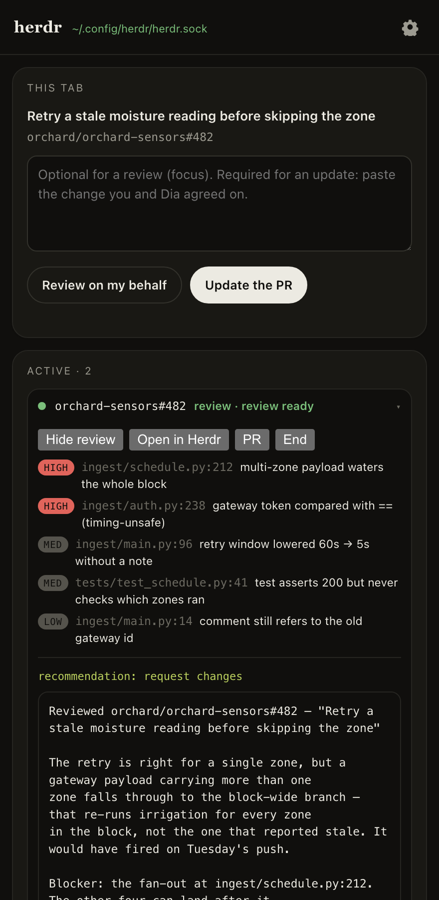
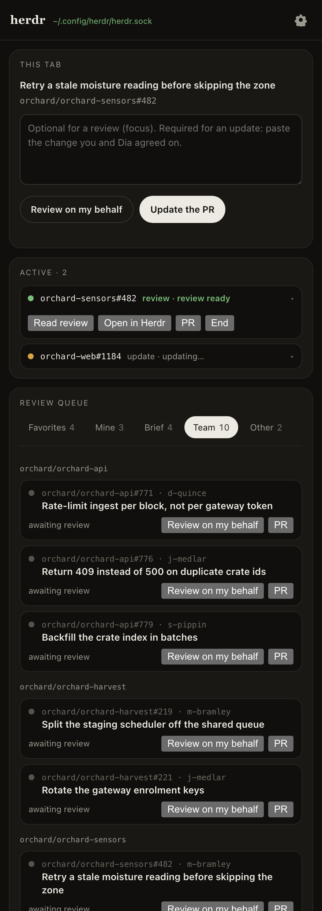
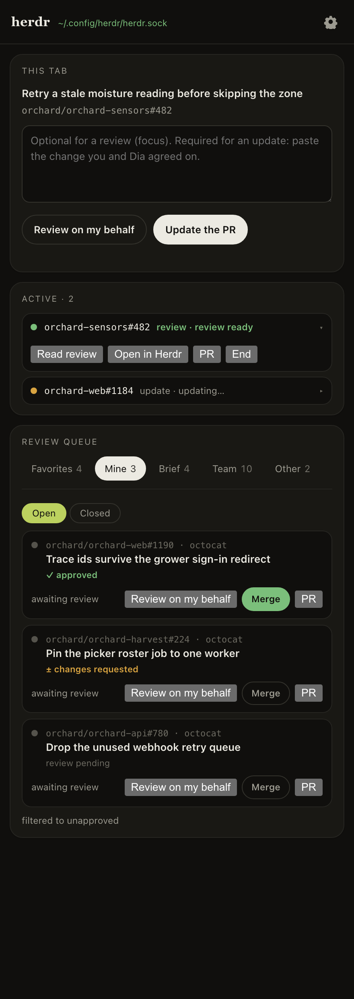
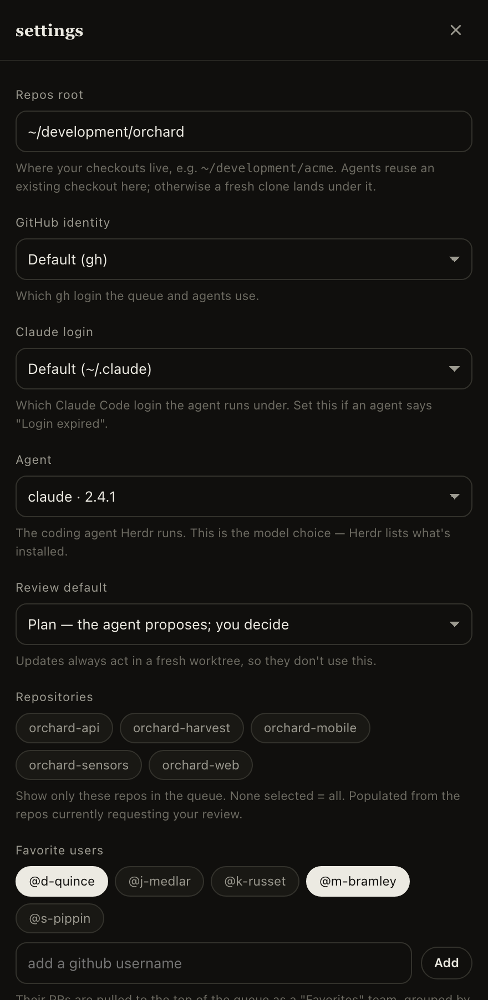

# herdr-dia

**Give Dia hands.** Dia can read a pull request and talk it through with you — but it can't
push commits, edit the branch, or change the PR. This extension adds the missing step: hand the
work to a [Herdr](https://herdr.dev) coding agent from the PR tab, watch it in the side panel,
and decide what happens next.

A Dia (or any Chromium) side panel, plus a Node native-messaging host that talks to your local
Herdr socket. No account, no server, no telemetry — the agent runs on your machine with your
own `gh` and git.

## What it looks like

<table>
<tr>
<td width="50%" valign="top">

<p><b>The review is ready, and the decision sits next to it.</b> Findings with severity and
file:line, the recommendation, and a box to tell the agent how to proceed. Typing in that box
is the approval.</p>
</td>
<td width="50%" valign="top">

<p><b>The queue is the product.</b> Tabs for what's addressed to you, what your team owes, the
authors you favourited, and your own PRs — Team grouped by repository, because CODEOWNERS asks
across dozens at once.</p>
</td>
</tr>
<tr>
<td width="50%" valign="top">

<p><b>Merge lights up only when it should.</b> Approved <em>and</em> mergeable, and it takes two
clicks. Everything else keeps it off.</p>
</td>
<td width="50%" valign="top">

<p><b>Nothing to type or guess.</b> Every dropdown is built from what's on the machine — your
<code>gh</code> logins, Claude configs, and the agents Herdr has installed.</p>
</td>
</tr>
</table>

> The real panel on invented data: `node scripts/demo.mjs` serves it with a fake `chrome` in
> front, so you can click through the whole UI with no Herdr, no GitHub account and nothing
> installed. Every repository, author and pull request in these shots is fictional.

## Install

Needs **Node 20+**, **Herdr** running, and **Dia** (or Chrome / Arc / Brave / Edge / Chromium).

```sh
node scripts/install.mjs
```

Then, in the browser: extensions page → developer mode → **Load unpacked** → the `extension/`
directory (the installer prints the path). Click the toolbar icon; a green socket path in the
panel header means you're connected.

Using an AI coding agent? Tell it **"install herdr-dia"** — [AGENTS.md](AGENTS.md) walks it
through, including the one step it can't do for you.

## What you get

- **A queue worth triaging.** Five tabs — Favourites, Mine, Brief, Team, Other — built from
  your GitHub notifications and review requests. Filter to the repos you care about; pull the
  authors you follow to the top.
- **Review on my behalf.** The agent reads the PR and writes the review as a *plan*: it can't
  post, edit or clone. You get findings, a recommendation, and two shortcuts — **Post as
  comment** or **Apply the fixes**.
- **Update the PR.** Paste what you and Dia agreed on. The agent works in its own git worktree,
  commits in the branch's style, and pushes to the PR branch. Your checkout is never touched.
- **An Active board.** One row per session, whatever needs you first: `reviewing…` →
  `review ready` → **End**. Drive several PRs at once without hunting through Herdr tabs.
- **Your own PRs.** The Mine tab shows review state, a ✓ approved badge, and a Merge button
  that only lights up when the PR is approved and mergeable.

Anything irreversible — a comment, a push, a merge — waits for your click.

## Tests

```sh
npm test
```

201 tests, zero dependencies, offline in about half a minute: a fake Herdr socket, a fake `gh`,
real git repositories in temp directories, and the real host driven over real native-messaging
framing. See [TESTING.md](TESTING.md).

## How it works

```
Dia side panel ── native messaging ── host/bridge.mjs ── ~/.config/herdr/herdr.sock ── Herdr
  panel.js: view + buttons            transparent pipe        workspaces · agents · events
```

The host forwards anything the panel sends straight to Herdr and returns whatever Herdr
answers; a handful of `dia.*` routes add the conveniences (the queue, launching, reading a
review back). [AGENTS.md](AGENTS.md) explains the whole design — the routes, the wire facts,
how sessions and worktrees are organised, and how to work on it.

## Not yet

- Capturing Dia's chat reply automatically (today you paste it).
- A `herdr-plugin.toml` so `herdr plugin install` does the registration.
- Anything beyond PRs — issues, Slack threads — is the same route with a different brief.

MIT licensed.
