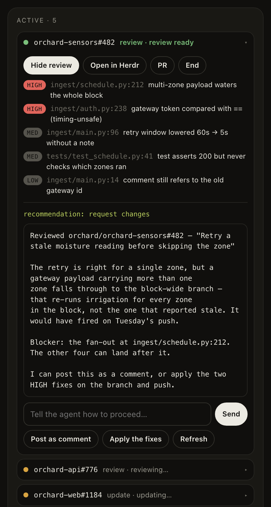
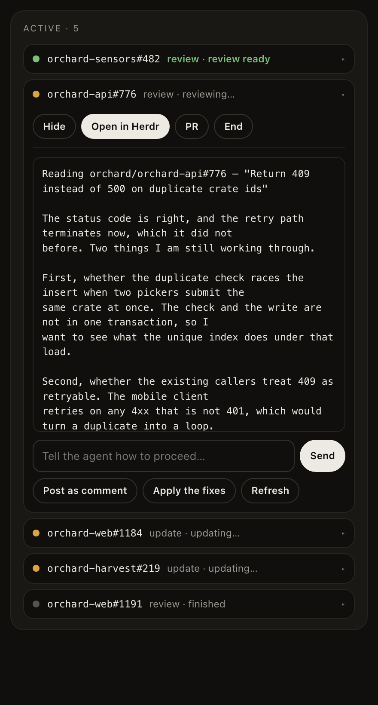
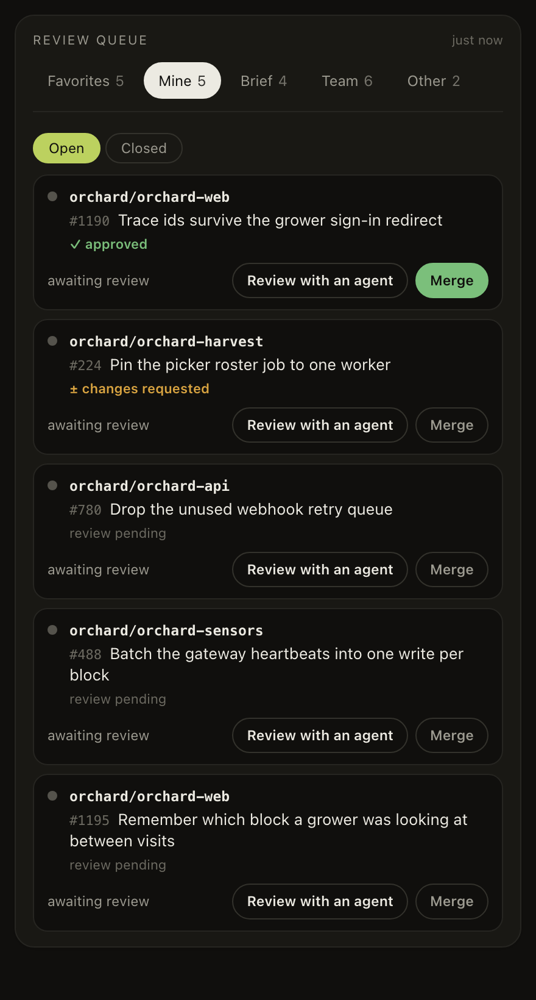
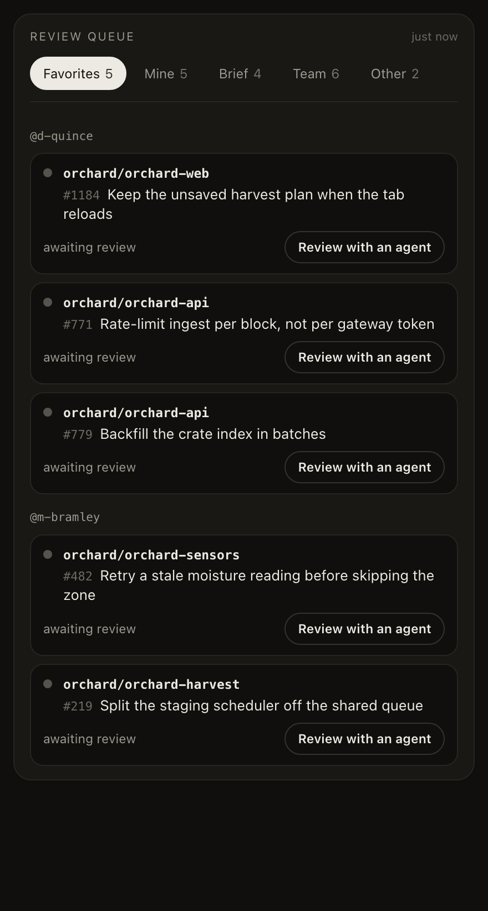

# herdr-dia

Give Dia hands.

Dia is good at reading a pull request and talking it through with you. What it can't do is act
on any of that: no commits, no edits to the branch, nothing that touches the PR. So this
extension picks up where the conversation stops. From the PR tab you hand the work to a
[Herdr](https://herdr.dev) coding agent, watch it run in the side panel, and decide what to do
with what it brings back.

It's a side panel for Dia (or any Chromium browser) plus a small Node host that talks to the
Herdr socket on your machine. There's no account to make and no server in the middle. The agent
runs locally, as you, with your own `gh` and git.

## What it looks like

<table>
<tr>
<td width="50%" valign="top">

<p><b>Read the review.</b> It opens in the panel, and the box under it goes straight back to the
agent, so you can say what you want next.</p>
</td>
<td width="50%" valign="top">

<p><b>Peek while it works.</b> You don't have to wait for the agent to finish. Open a running
review and read what it has so far.</p>
</td>
</tr>
<tr>
<td width="50%" valign="top">

<p><b>Merge your own.</b> Mine tracks where each review stands, and Merge only wakes up once a
PR is approved and mergeable.</p>
</td>
<td width="50%" valign="top">

<p><b>Follow the people you work with.</b> Their PRs get pulled out of the pile and grouped by
author, so the ones you actually review come first.</p>
</td>
</tr>
</table>

> These are the real panel running on made-up data. `node scripts/demo.mjs` serves it with a
> fake `chrome` in front, so you can click around the whole thing without Herdr, a GitHub
> account, or installing anything. Every repo, author and PR you see is invented.

## Install

You'll need Node 20 or newer, Herdr running, and Dia (or Chrome, Arc, Brave, Edge, Chromium).

```sh
node scripts/install.mjs
```

Then load it in the browser: extensions page, turn on developer mode, hit Load unpacked, and
pick the `extension/` directory. The installer prints the full path, so you can paste it. Click
the toolbar icon and you should see a green socket path in the panel header.

If you'd rather not do any of that yourself, tell an AI coding agent to "install herdr-dia" and
point it at [AGENTS.md](AGENTS.md). It can handle everything except the one click that has to
be yours.

## What you get

- **A queue worth opening.** Five tabs (Favorites, Mine, Brief, Team, Other) built from your
  GitHub notifications and review requests. Narrow it to the repos you care about, and the
  people you follow get pulled to the top.
- **Review with an agent.** Claude Code reads the PR in plan mode, so while it works it can't
  post, edit or clone anything. You get findings, a recommendation, and two shortcuts: post it
  as a comment, or apply the fixes. Other agents have no plan mode, so they write their review
  and post it themselves.
- **Update the PR.** Paste in what you and Dia agreed on. The agent gets a git worktree of its
  own, commits in the style of the branch, and pushes to the PR. Your checkout stays exactly as
  you left it.
- **An Active board.** One row per session, sorted so the one that needs you shows up first,
  from `reviewing…` through `review ready`. You can keep several PRs going at once without
  hunting through Herdr tabs.
- **Your own PRs.** The Mine tab tracks where each review stands, with a ✓ approved badge and a
  Merge button that only comes alive when the PR is approved and mergeable.

Nothing irreversible happens that you didn't ask for. An update pushes because you asked for an
update, and in plan mode the finished review sits in the panel until you say post it.

## Tests

```sh
npm test
```

223 tests, no dependencies, and the whole thing runs offline in about half a minute. There's a
fake Herdr socket, a fake `gh`, real git repositories in temp directories, and the actual host
driven over the same native-messaging framing the browser uses. [TESTING.md](TESTING.md) has
the details.

## How it works

```
Dia side panel ── native messaging ── host/bridge.mjs ── ~/.config/herdr/herdr.sock ── Herdr
  panel.js: view + buttons            transparent pipe        workspaces · agents · events
```

The host is mostly a pipe: whatever the panel sends goes straight to Herdr, and whatever Herdr
answers comes straight back. On top of that sit a handful of `dia.*` routes for the things
worth doing in one step, like building the queue or reading a review back out of an agent. If
you want the whole design, [AGENTS.md](AGENTS.md) covers the routes, the protocol quirks, and
how sessions and worktrees hang together.

[REPORT.md](REPORT.md) is the short version, also at
[herdr-dia.kevgibson.com](https://herdr-dia.kevgibson.com): what it does today, what a version
built into Dia could do, and the tradeoffs. [HANDOFF.md](HANDOFF.md) is the design document behind it,
with the decision records under [docs/adr](docs/adr/README.md).

## Not yet

- Pulling Dia's reply in automatically. For now you paste it.
- A `herdr-plugin.toml`, so `herdr plugin install` could do the registration for you.
- Issues, Slack threads, anything that isn't a PR. Same machinery, different brief, not built.

MIT licensed.
